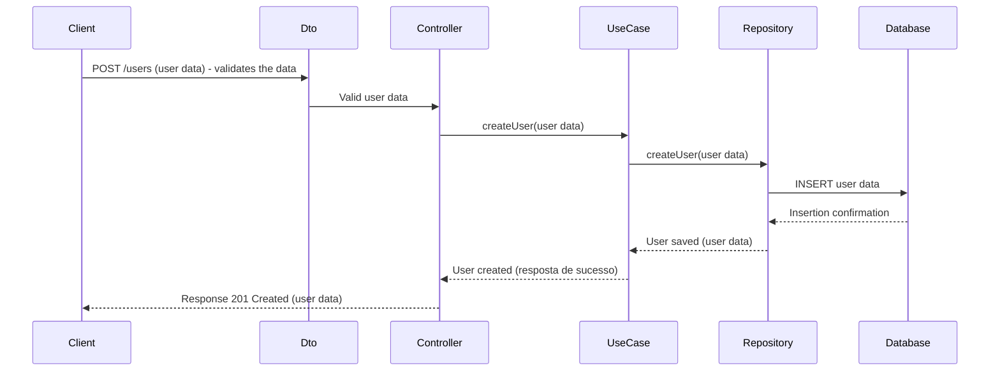
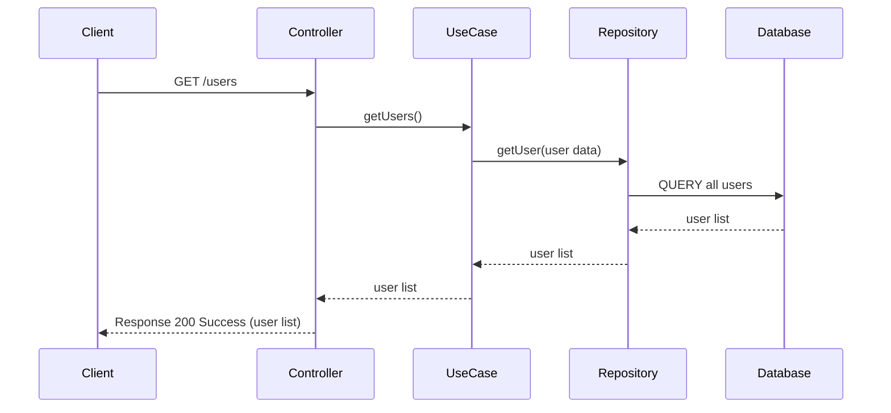
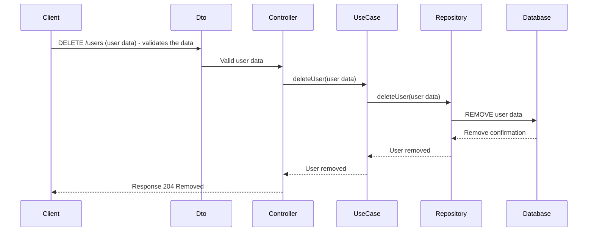
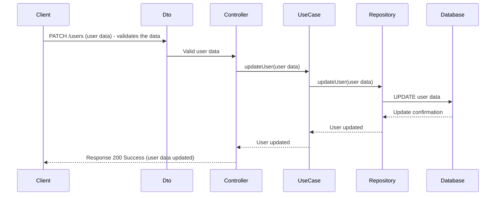

# Users API

This is a project to build the API for users of the Lab applications, generally school students.

## Diagramas

### POST /users

Sequence diagram of create user process.

### GET /users

Sequence diagram of get all users process.

### DELETE /users

Sequence diagram of delete user process.

### UPDATE /users

Sequence diagram of update user process.

