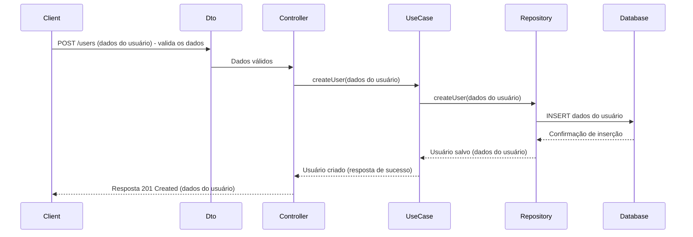
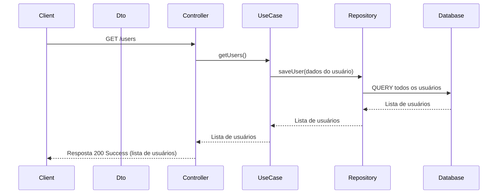

# Users API

## Diagramas

### POST /users

```mermaid
sequenceDiagram
    participant Client
    participant Dto
    participant Controller
    participant UseCase
    participant Repository
    participant Database

    Client->>Dto: POST /users (dados do usuário) - valida os dados
    Dto->>Controller: Dados válidos
    Controller->>UseCase: createUser(dados do usuário)
    UseCase->>Repository: createUser(dados do usuário)
    Repository->>Database: INSERT dados do usuário
    Database-->>Repository: Confirmação de inserção
    Repository-->>UseCase: Usuário salvo (dados do usuário)
    UseCase-->>Controller: Usuário criado (resposta de sucesso)
    Controller-->>Client: Resposta 201 Created (dados do usuário)
```

### GET /users

```mermaid
sequenceDiagram
    participant Client
    participant Dto
    participant Controller
    participant UseCase
    participant Repository
    participant Database

    Client->>Controller: GET /users
    Controller->>UseCase: getUsers()
    UseCase->>Repository: saveUser(dados do usuário)
    Repository->>Database: QUERY todos os usuários
    Database-->>Repository: Lista de usuários
    Repository-->>UseCase: Lista de usuários
    UseCase-->>Controller: Lista de usuários
    Controller-->>Client: Resposta 200 Success (lista de usuários)
```
